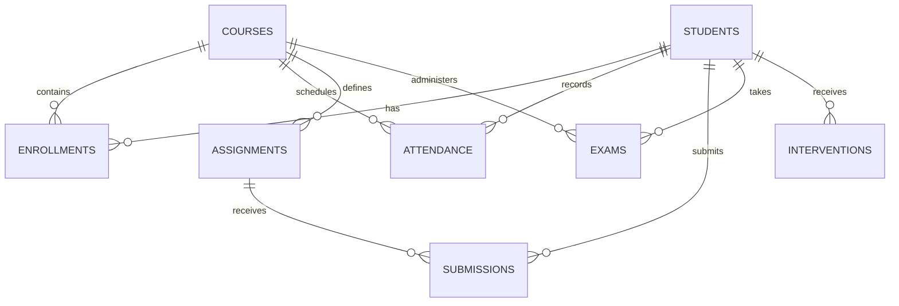

# Academic Engagement Risk Dashboard — Data Dictionary

This document provides a comprehensive, professional data dictionary for all data entities and attributes utilized across the **Academic Engagement Risk Dashboard**.

---

## 1. Overview & Data Sources

The dashboard integrates data across multiple institutional systems:
1. **Student Information System (SIS)**: Student demographics, course offerings, and enrollment rosters.
2. **Learning Management System (LMS)**: Classroom attendance logs, assignment specifications, and student submissions.
3. **Assessment & Grading Portal**: Formal midterm, final, and practical examination scores.
4. **Academic Advisor Tracking**: Follow-up notes, supportive intervention types, and case resolution statuses.

### Core Data Principles
- **No Zero Imputation**: Missing scores or unrecorded attendance sessions are explicitly treated as `Unrecorded / Missing` and never imputed as zero performance.
- **Explainable Lineage**: Every risk metric on the dashboard can be traced back directly to one or more attributes in this dictionary.

---

## 2. Entity Specifications

---

### 2.1 Entity: `students`
Stores core student identity, academic program, and cohort classification.

| Field Name | Type | Source | Expected Values | Required | Analytical Usage |
| :--- | :--- | :--- | :--- | :--- | :--- |
| `student_id` | `VARCHAR(32)` | SIS | Alphanumeric (e.g. `STU-1001`) | **Yes** | Primary key. Unique entity identifier for student profile drill-down, cohort tracking, and risk attribution. |
| `name` | `VARCHAR(100)` | SIS | Non-empty text string | **Yes** | Student name for dashboard presentation, search filtering, and faculty advisory logs. |
| `program` | `VARCHAR(100)` | SIS | Categorical (e.g. `Computer Science`, `Information Technology`) | **Yes** | Program-level cohort filtering, comparative academic health metrics, and department breakdown. |
| `year` | `INTEGER` | SIS | Integer `1` to `4` | **Yes** | Academic level segmentation; identifies cohort-specific engagement patterns across degree years. |

---

### 2.2 Entity: `courses`
Contains course catalog information and assigned faculty.

| Field Name | Type | Source | Expected Values | Required | Analytical Usage |
| :--- | :--- | :--- | :--- | :--- | :--- |
| `course_id` | `VARCHAR(32)` | SIS / Catalog | Alphanumeric code (e.g. `CS101`, `DS202`) | **Yes** | Primary key. Unique identifier for course analytics, subject comparisons, and syllabus tracking. |
| `course_name` | `VARCHAR(100)` | SIS | Course title (e.g. `Data Structures`) | **Yes** | Display label in overview charts, directory filters, and student profile course enrollments. |
| `faculty` | `VARCHAR(100)` | SIS / HR | Instructor name (e.g. `Dr. Smith`) | **Yes** | Instructor-level filtering; allows advisors to review metrics by faculty member. |

---

### 2.3 Entity: `enrollments`
Associates students with their registered academic courses.

| Field Name | Type | Source | Expected Values | Required | Analytical Usage |
| :--- | :--- | :--- | :--- | :--- | :--- |
| `student_id` | `VARCHAR(32)` | SIS Enrollment | Foreign key referencing `students.student_id` | **Yes** | Composite primary key component; defines which students are registered for which classes. |
| `course_id` | `VARCHAR(32)` | SIS Enrollment | Foreign key referencing `courses.course_id` | **Yes** | Composite primary key component; computes class size, expected assignments, and attendance capacity. |

---

### 2.4 Entity: `attendance`
Captures session-by-session student presence and absence across courses.

| Field Name | Type | Source | Expected Values | Required | Analytical Usage |
| :--- | :--- | :--- | :--- | :--- | :--- |
| `student_id` | `VARCHAR(32)` | LMS / RFID | Foreign key referencing `students.student_id` | **Yes** | Student-level attendance calculation and historical engagement tracking. |
| `course_id` | `VARCHAR(32)` | LMS | Foreign key referencing `courses.course_id` | **Yes** | Course-level average attendance aggregation and cohort engagement trends. |
| `date` | `DATE` | LMS Session | `YYYY-MM-DD` calendar date | **Yes** | Time-series trend calculation; computes recent attendance vs baseline (e.g. 4-week moving trend). |
| `status` | `VARCHAR(20)` | LMS Session | `Present`, `Absent`, `Late`, `Excused` | **Yes** | Attendance percentage formula: `(Present + 0.5 * Late) / Total Sessions`. Concern trigger: `< 75%`. |

---

### 2.5 Entity: `assignments`
Defines coursework deliverables assigned by faculty.

| Field Name | Type | Source | Expected Values | Required | Analytical Usage |
| :--- | :--- | :--- | :--- | :--- | :--- |
| `assignment_id` | `VARCHAR(32)` | LMS Course Syllabus | Alphanumeric (e.g. `ASN-01`) | **Yes** | Primary key. Identifies discrete required coursework deliverables. |
| `course_id` | `VARCHAR(32)` | LMS | Foreign key referencing `courses.course_id` | **Yes** | Links assignment deliverable to specific curriculum and course analytics. |
| `title` | `VARCHAR(150)` | LMS | Descriptive text (e.g. `SQL Optimization`) | **Yes** | Display title in student profile assignment lists and recent activity timelines. |
| `due_date` | `DATE` | LMS Calendar | `YYYY-MM-DD` | **Yes** | Baseline for evaluating submission timeliness; classifies past-due missing tasks. |

---

### 2.6 Entity: `submissions`
Records individual student assignment submissions and scores.

| Field Name | Type | Source | Expected Values | Required | Analytical Usage |
| :--- | :--- | :--- | :--- | :--- | :--- |
| `assignment_id` | `VARCHAR(32)` | LMS Submission Log | Foreign key referencing `assignments.assignment_id` | **Yes** | Identifies target coursework deliverable. |
| `student_id` | `VARCHAR(32)` | LMS Submission Log | Foreign key referencing `students.student_id` | **Yes** | Student attribution for completion rate and coursework scores. |
| `submission_date` | `DATE` | LMS Timestamp | `YYYY-MM-DD` (or `null` if unsubmitted) | **No** (Nullable) | Timeliness calculation: `submission_date > due_date` triggers `Late` status; missing = `Missing`. |
| `score` | `FLOAT` | Gradebook | `0.0` to `100.0` (or `null` if unrecorded) | **No** (Nullable) | Assignment average score. Concern trigger: `< 70%` completion or recent performance drop. |

---

### 2.7 Entity: `exams`
Captures formal summative assessment performance (midterms, finals, quizzes).

| Field Name | Type | Source | Expected Values | Required | Analytical Usage |
| :--- | :--- | :--- | :--- | :--- | :--- |
| `exam_id` | `VARCHAR(32)` | Assessment Portal | Alphanumeric (e.g. `EXM-01`) | **Yes** | Primary key. Identifies formal assessment event. |
| `student_id` | `VARCHAR(32)` | Assessment Portal | Foreign key referencing `students.student_id` | **Yes** | Student attribution for assessment average. |
| `course_id` | `VARCHAR(32)` | Assessment Portal | Foreign key referencing `courses.course_id` | **Yes** | Course-level grade distributions and subject-level exam health metrics. |
| `exam_type` | `VARCHAR(50)` | Assessment Portal | `Midterm`, `Final`, `Quiz`, `Practical` | **Yes** | Assessment category grouping and exam score weighting. |
| `score` | `FLOAT` | Grading Registry | `0.0` to `100.0` (or `null` if absent) | **No** (Nullable) | Average exam score and trend calculation. Concern trigger: `< 50%` or score decline `> 15%`. |

---

### 2.8 Entity: `interventions`
Maintains advisory check-in records, support plans, and follow-up statuses.

| Field Name | Type | Source | Expected Values | Required | Analytical Usage |
| :--- | :--- | :--- | :--- | :--- | :--- |
| `id` | `INTEGER` | Dashboard DB | Positive auto-incrementing integer | **Yes** | Primary key for logged advisory support record. |
| `student_id` | `VARCHAR(32)` | Dashboard Form | Foreign key referencing `students.student_id` | **Yes** | Associates intervention action with specific student profile. |
| `date` | `DATE` | Advisor Form | `YYYY-MM-DD` | **Yes** | Timeline of student support; enables auditing of faculty-student check-in frequency. |
| `type` | `VARCHAR(50)` | Advisor Form | `Academic check-in`, `Faculty discussion`, `Study support`, `Other` | **Yes** | Categorization of support mechanism for institutional review and intervention analytics. |
| `status` | `VARCHAR(30)` | Advisor Form | `Open`, `In Progress`, `Resolved` | **Yes** | Lifecycle status tracking; highlights pending follow-ups requiring advisor attention. |
| `notes` | `TEXT` | Advisor Form | Qualitative text (up to 2000 characters) | **Yes** | Contextual evidence, agreed action steps, and academic support notes. |

---

## 3. Risk Threshold Project Assumptions

The following thresholds are documented project assumptions and are not presented as universal standards:

| Risk Signal | Threshold | Analytical Interpretation | Evidence Display |
| :--- | :--- | :--- | :--- |
| **Attendance Concern** | `< 75%` | Classroom disengagement; missed learning sessions | `Attendance: 68% (Target: >= 75%)` |
| **Assignment Concern** | `< 70%` | Incomplete coursework; missing continuous assessment | `Assignment Completion: 62% (Target: >= 70%)` |
| **Exam Performance Concern** | `< 50%` | Low assessment scores requiring academic tutorial support | `Exam Average: 46% (Target: >= 50%)` |
| **Performance Decline Trend** | `> 15% drop` | Significant drop between baseline and recent period | `Exam Trend: -18 percentage points` |
| **Attendance Decline Trend** | `> 15% drop` | Rapidly declining presence over the last 3-4 weeks | `Attendance Trend: -17 percentage points` |
